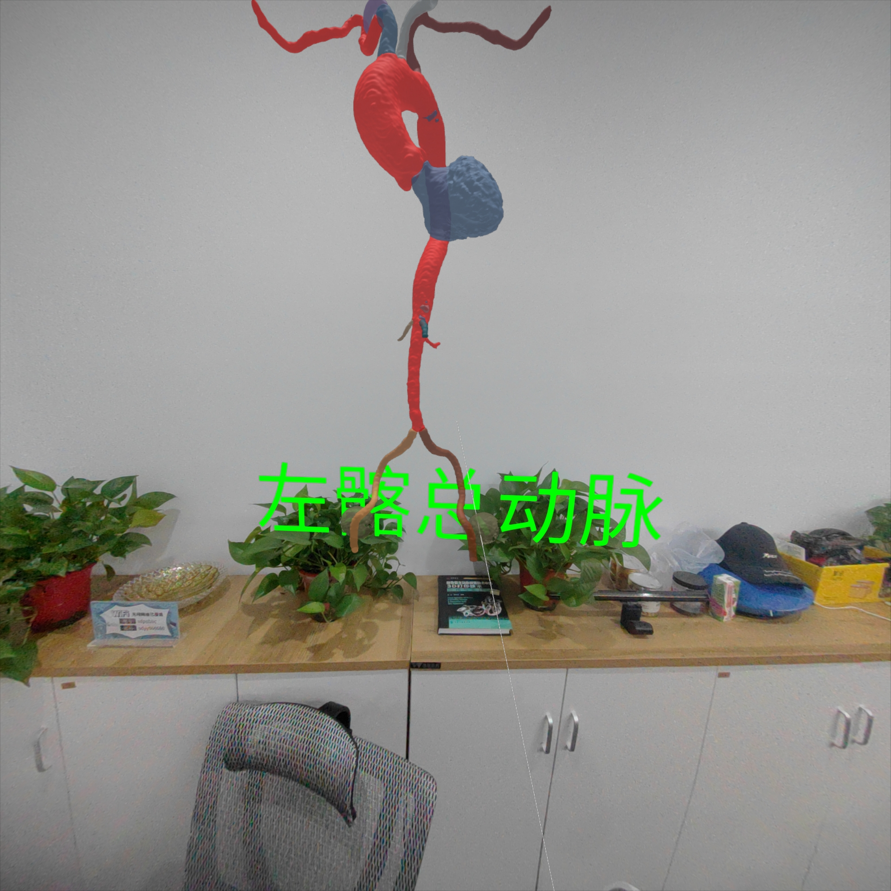

# React + TypeScript + Vite + THREE.js + Pico4

- 使用Pico4头戴式VR设备对控制器进行交互式控制(Interactive control of controllers using Pico4 head mounted VR devices)
- 外周血管模型分割来自“拓微摹心数据科技"(Peripheral vascular model segmentation from "拓微摹心数据科技")
- 看看R3F版本，由于某种原因，FPS非常低😁(Just take a look at the R3F version, for some reason, the FPS is very low 😁)
- 代码太糟糕了，请不要喷我，这只是一个演示(The code is terrible, please don't spray me, it's just a demo)
- stl模型仅供学习和参考，请勿传播，(The stl model is for learning and reference only, please do not spread it、)

感谢公司算法、标注部门的辛苦分割和标注

作者邮箱：himozzie@foxmail.com，WeChat ID: x-arctanx，欢迎交流 👏🏻👏🏻👏🏻
